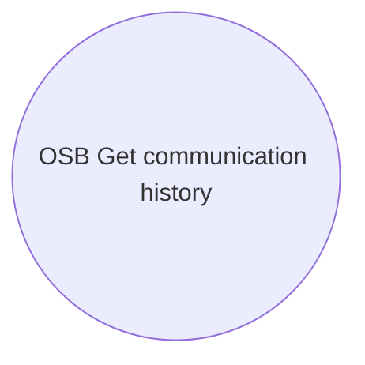

# Temporary - OSB elements

- **Diagram Type**: Use Case
- **Package**: HomerSelect/BSL/Analysis Model/_Interface/Consumed services/CRM - communication/Temporary - OSB elements
- **Diagram ID**: 106487
- **Elements**: 1
- **Connectors**: 0

