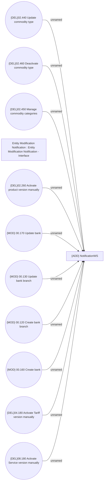

# Entity Modification Notification - Involved Use Cases

- **Diagram Type**: Use Case
- **Package**: HomerSelect/BSL/Analysis Model/_Interface/Consumed services/Notifications/Entity Modification Notification
- **Diagram ID**: 162292
- **Elements**: 12
- **Connectors**: 10

