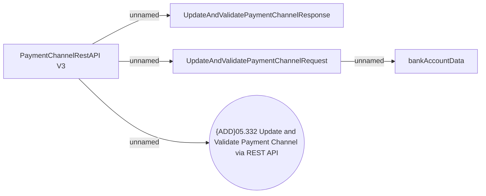

# PaymentChannelRestAPI - Update And Validate Payment Channel

- **Diagram Type**: Use Case
- **Package**: HomerSelect/BSL/Analysis Model/_Interface/Provided Web Services/Payments/PaymentChannelRestAPI/PaymentChannelRestAPI v3
- **Diagram ID**: 153949
- **Elements**: 5
- **Connectors**: 4

