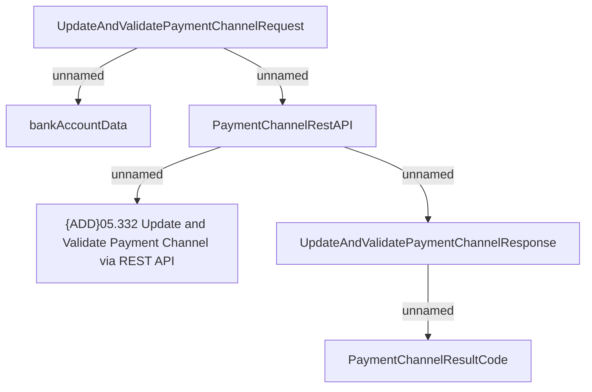

# PaymentChannelRestAPI - Update And Validate Payment Channel

```mermaid
graph TD
    bankAccountData["bankAccountData"]
    ADD_05_332_Update_and_Validate_Payment_Channel_via_REST_API["{ADD}05.332 Update and Validate Payment Channel via REST API"]
    PaymentChannelResultCode["PaymentChannelResultCode"]
    UpdateAndValidatePaymentChannelResponse["UpdateAndValidatePaymentChannelResponse"]
    UpdateAndValidatePaymentChannelRequest["UpdateAndValidatePaymentChannelRequest"]
    PaymentChannelRestAPI["PaymentChannelRestAPI"]
    PaymentChannelRestAPI -->|unnamed| UpdateAndValidatePaymentChannelResponse
    PaymentChannelRestAPI -->|unnamed| ADD_05_332_Update_and_Validate_Payment_Channel_via_REST_API
    UpdateAndValidatePaymentChannelRequest -->|unnamed| bankAccountData
    UpdateAndValidatePaymentChannelResponse -->|unnamed| PaymentChannelResultCode
    UpdateAndValidatePaymentChannelRequest -->|unnamed| PaymentChannelRestAPI
```
