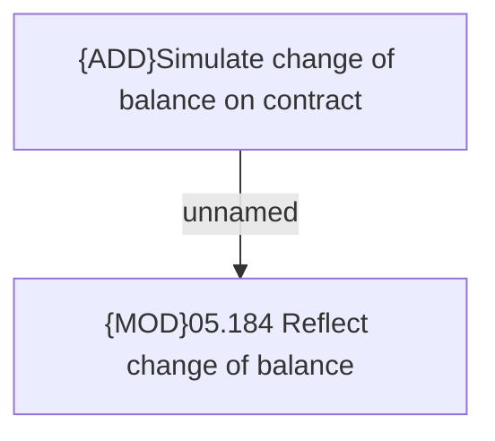

# Contract service manipulations

```mermaid
graph TD
    MOD_05_184_Reflect_change_of_balance["{MOD}05.184 Reflect change of balance"]
    ADD_Simulate_change_of_balance_on_contract["{ADD}Simulate change of balance on contract"]
    ADD_Simulate_change_of_balance_on_contract -->|unnamed| MOD_05_184_Reflect_change_of_balance
```
