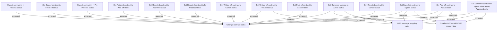

# Contract status manipulation

```mermaid
graph TD
    Set_Signed_contract_to_Finished_status["Set Signed contract to Finished status"]
    Set_Finished_contract_to_Paid_off_status["Set Finished contract to Paid-off status"]
    Set_Written_off_contract_to_Finished_status["Set Written-off contract to Finished status"]
    Set_Canceled_contract_to_Active_status["Set Canceled contract to Active status"]
    Set_Canceled_contract_to_Signed_when_it_was_Approved_only["Set Canceled contract to Signed when it was Approved only"]
    Set_Paid_off_contract_to_Active_status["Set Paid-off contract to Active status"]
    Creation_INSTALMENT120_record_rules["Creation INSTALMENT120 record rules"]
    OBS_message_mapping_rules["OBS message mapping rules"]
    Set_Canceled_contract_to_Signed_status["Set Canceled contract to Signed status"]
    Set_Rejected_contract_to_Approved_status["Set Rejected contract to Approved status"]
    Set_Rejected_contract_to_In_Process_status["Set Rejected contract to In Process status"]
    Set_Written_off_contract_to_Cancel_status["Set Written-off contract to Cancel status"]
    Set_Rejected_contract_to_Cancel_status["Set Rejected contract to Cancel status"]
    Set_Paid_off_contract_to_Cancel_status["Set Paid-off contract to Cancel status"]
    Cancel_contract_in_In_Process_status["Cancel contract in In Process status"]
    Change_contract_status["Change contract status"]
    Cancel_contract_in_In_Pre_Process_status["Cancel contract in In Pre-Process status"]
    Set_Rejected_contract_to_Cancel_status -->|unnamed| Change_contract_status
    Set_Canceled_contract_to_Signed_when_it_was_Approved_only -->|unnamed| Creation_INSTALMENT120_record_rules
    Set_Paid_off_contract_to_Active_status -->|unnamed| Creation_INSTALMENT120_record_rules
    Set_Canceled_contract_to_Signed_status -->|unnamed| Creation_INSTALMENT120_record_rules
    Set_Canceled_contract_to_Signed_when_it_was_Approved_only -->|unnamed| OBS_message_mapping_rules
    Set_Canceled_contract_to_Active_status -->|unnamed| OBS_message_mapping_rules
    Set_Written_off_contract_to_Finished_status -->|unnamed| OBS_message_mapping_rules
    Set_Canceled_contract_to_Signed_status -->|unnamed| OBS_message_mapping_rules
    Set_Paid_off_contract_to_Active_status -->|unnamed| OBS_message_mapping_rules
    Set_Paid_off_contract_to_Active_status -->|unnamed| Change_contract_status
    Set_Canceled_contract_to_Active_status -->|unnamed| Creation_INSTALMENT120_record_rules
    Set_Paid_off_contract_to_Cancel_status -->|unnamed| Change_contract_status
    Set_Canceled_contract_to_Signed_when_it_was_Approved_only -->|unnamed| Change_contract_status
    Set_Written_off_contract_to_Cancel_status -->|unnamed| Change_contract_status
    Set_Rejected_contract_to_In_Process_status -->|unnamed| Change_contract_status
    Set_Rejected_contract_to_Approved_status -->|unnamed| Change_contract_status
    Set_Canceled_contract_to_Signed_status -->|unnamed| Change_contract_status
    Set_Finished_contract_to_Paid_off_status -->|unnamed| Change_contract_status
    Set_Written_off_contract_to_Finished_status -->|unnamed| Change_contract_status
    Cancel_contract_in_In_Pre_Process_status -->|unnamed| Change_contract_status
    Set_Canceled_contract_to_Active_status -->|unnamed| Change_contract_status
    Set_Signed_contract_to_Finished_status -->|unnamed| Change_contract_status
    Cancel_contract_in_In_Process_status -->|unnamed| Change_contract_status
```
