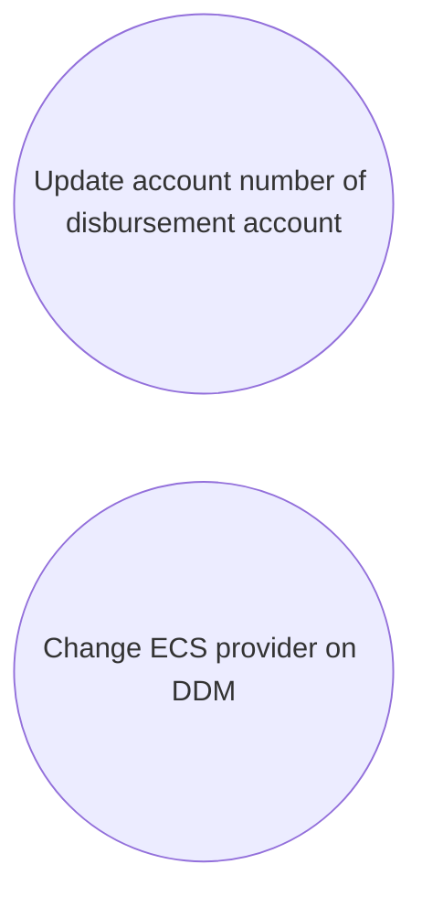

# DDM and DDS manipulations

- **Diagram Type**: Use Case
- **Package**: HomerSelect/BSL/Data manipulation support/HS3.0 and later/DDM and DDS manipulations
- **Diagram ID**: 147030
- **Elements**: 2
- **Connectors**: 0

