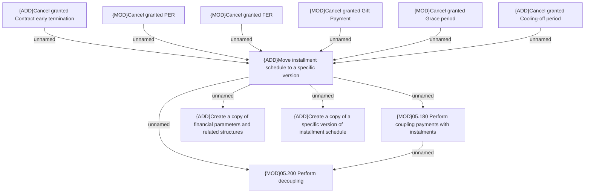

# Installment schedule manipulations

```mermaid
graph TD
    ADD_Cancel_granted_Cooling_off_period["{ADD}Cancel granted Cooling-off period"]
    ADD_Cancel_granted_Contract_early_termination["{ADD}Cancel granted Contract early termination"]
    MOD_Cancel_granted_PER["{MOD}Cancel granted PER"]
    MOD_Cancel_granted_FER["{MOD}Cancel granted FER"]
    MOD_Cancel_granted_Gift_Payment["{MOD}Cancel granted Gift Payment"]
    MOD_Cancel_granted_Grace_period["{MOD}Cancel granted Grace period"]
    MOD_05_200_Perform_decoupling["{MOD}05.200 Perform decoupling"]
    MOD_05_180_Perform_coupling_payments_with_instalments["{MOD}05.180 Perform coupling payments with instalments"]
    ADD_Create_a_copy_of_financial_parameters_and_related_struct["{ADD}Create a copy of financial parameters and related structures"]
    ADD_Create_a_copy_of_a_specific_version_of_installment_sched["{ADD}Create a copy of a specific version of installment schedule"]
    ADD_Move_installment_schedule_to_a_specific_version["{ADD}Move installment schedule to a specific version"]
    ADD_Cancel_granted_Contract_early_termination -->|unnamed| ADD_Move_installment_schedule_to_a_specific_version
    MOD_Cancel_granted_PER -->|unnamed| ADD_Move_installment_schedule_to_a_specific_version
    MOD_Cancel_granted_FER -->|unnamed| ADD_Move_installment_schedule_to_a_specific_version
    MOD_Cancel_granted_Gift_Payment -->|unnamed| ADD_Move_installment_schedule_to_a_specific_version
    MOD_Cancel_granted_Grace_period -->|unnamed| ADD_Move_installment_schedule_to_a_specific_version
    ADD_Cancel_granted_Cooling_off_period -->|unnamed| ADD_Move_installment_schedule_to_a_specific_version
    ADD_Move_installment_schedule_to_a_specific_version -->|unnamed| ADD_Create_a_copy_of_a_specific_version_of_installment_sched
    ADD_Move_installment_schedule_to_a_specific_version -->|unnamed| ADD_Create_a_copy_of_financial_parameters_and_related_struct
    ADD_Move_installment_schedule_to_a_specific_version -->|unnamed| MOD_05_180_Perform_coupling_payments_with_instalments
    ADD_Move_installment_schedule_to_a_specific_version -->|unnamed| MOD_05_200_Perform_decoupling
    MOD_05_180_Perform_coupling_payments_with_instalments -->|unnamed| MOD_05_200_Perform_decoupling
```
