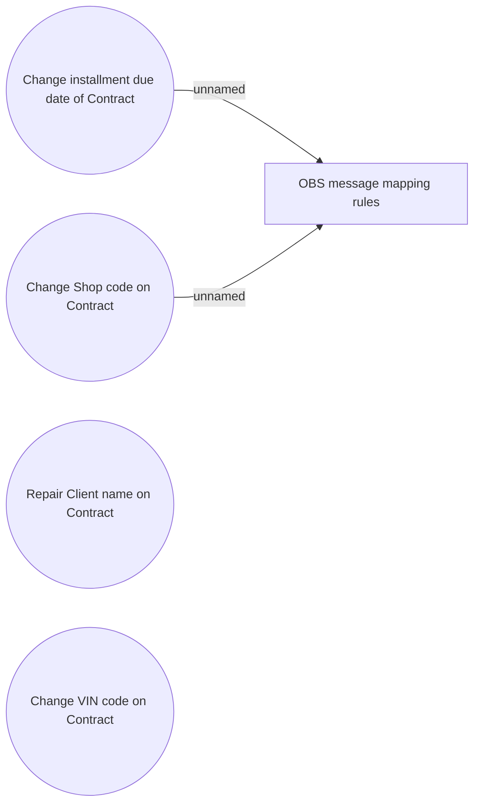

# Other contract manipulations

- **Diagram Type**: Use Case
- **Package**: HomerSelect/BSL/Data manipulation support/HS3.0 and later/Other contract manipulations
- **Diagram ID**: 104070
- **Elements**: 5
- **Connectors**: 2

