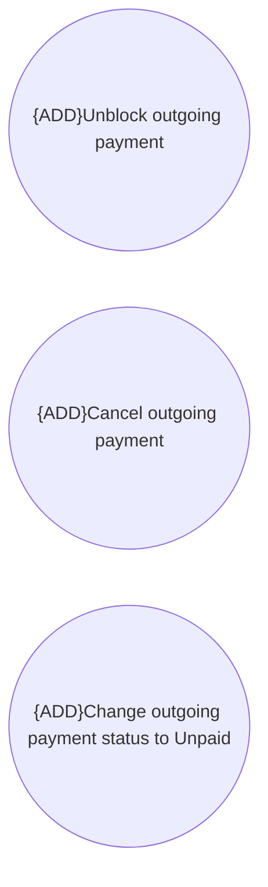

# Outgoing payment manipulations

- **Diagram Type**: Use Case
- **Package**: HomerSelect/BSL/Data manipulation support/HS3.0 and later/Outgoing payment manipulations
- **Diagram ID**: 143353
- **Elements**: 3
- **Connectors**: 0

