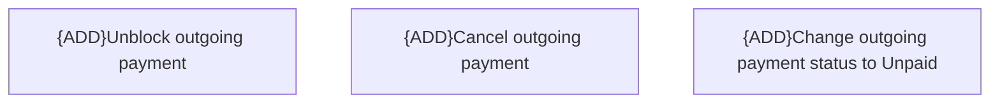

# Outgoing payment manipulations

```mermaid
graph TD
    ADD_Unblock_outgoing_payment["{ADD}Unblock outgoing payment"]
    ADD_Cancel_outgoing_payment["{ADD}Cancel outgoing payment"]
    ADD_Change_outgoing_payment_status_to_Unpaid["{ADD}Change outgoing payment status to Unpaid"]
```
