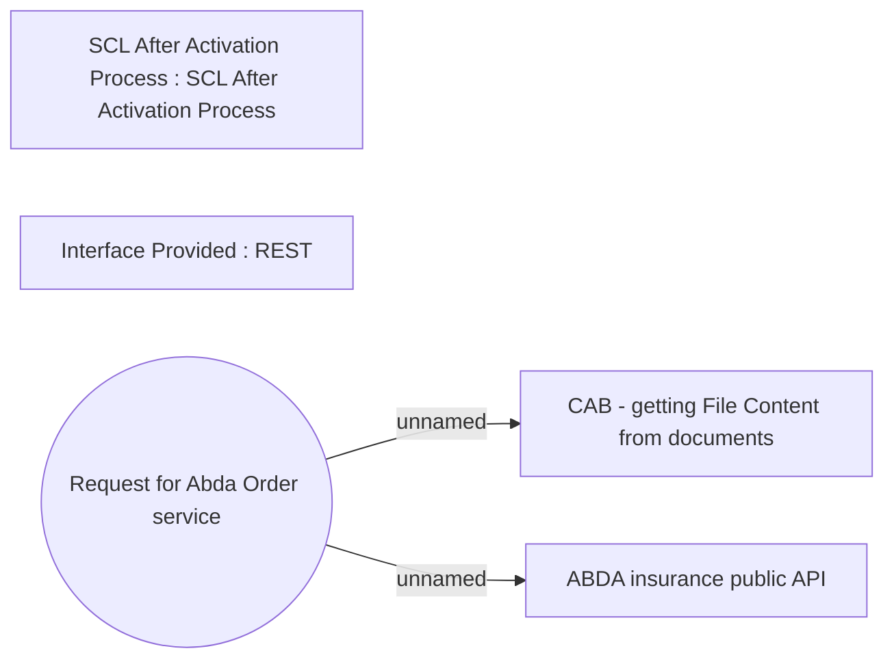

# Analytical Model

- **Diagram Type**: Use Case
- **Package**: HomerSelect/BSL/Modules/ABDA/Analytical Model
- **Diagram ID**: 160661
- **Elements**: 5
- **Connectors**: 2

```mermaid
graph LR
    SCL_After_Activation_Process_SCL_After_Activation_Process["SCL After Activation Process : SCL After Activation Process"]
    Interface_Provided_REST["Interface Provided : REST"]
    CAB_getting_File_Content_from_documents["CAB - getting File Content from documents"]
    ABDA_insurance_public_API["ABDA insurance public API"]
    Request_for_Abda_Order_service(("Request for Abda Order service"))
    Request_for_Abda_Order_service -->|unnamed| CAB_getting_File_Content_from_documents
    Request_for_Abda_Order_service -->|unnamed| ABDA_insurance_public_API
```
