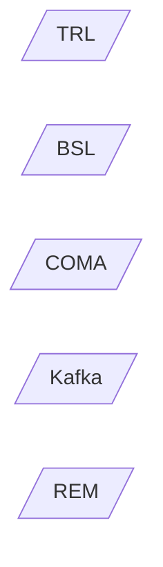

# Actors

- **Diagram Type**: Use Case
- **Package**: HomerSelect/BSL/Modules/CEL Account (CELA)/Actors
- **Diagram ID**: 155964
- **Elements**: 5
- **Connectors**: 0

```mermaid
graph LR
    TRL[/"TRL"/]
    BSL[/"BSL"/]
    COMA[/"COMA"/]
    Kafka[/"Kafka"/]
    REM[/"REM"/]
```
