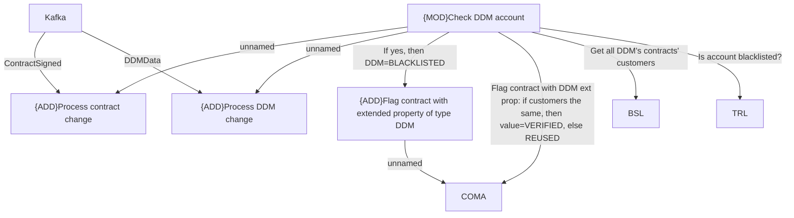

# DDM validation

```mermaid
graph TD
    ADD_Flag_contract_with_extended_property_of_type_DDM["{ADD}Flag contract with extended property of type DDM"]
    ADD_Process_DDM_change["{ADD}Process DDM change"]
    MOD_Check_DDM_account["{MOD}Check DDM account"]
    ADD_Process_contract_change["{ADD}Process contract change"]
    Kafka["Kafka"]
    TRL["TRL"]
    COMA["COMA"]
    BSL["BSL"]
    Kafka -->|ContractSigned| ADD_Process_contract_change
    Kafka -->|DDMData| ADD_Process_DDM_change
    ADD_Flag_contract_with_extended_property_of_type_DDM -->|unnamed| COMA
    MOD_Check_DDM_account -->|unnamed| ADD_Process_contract_change
    MOD_Check_DDM_account -->|unnamed| ADD_Process_DDM_change
    MOD_Check_DDM_account -->|If yes, then DDM=BLACKLISTED| ADD_Flag_contract_with_extended_property_of_type_DDM
    MOD_Check_DDM_account -->|Flag contract with DDM ext prop: if customers the same, then value=VERIFIED, else REUSED| COMA
    MOD_Check_DDM_account -->|Get all DDM's contracts' customers| BSL
    MOD_Check_DDM_account -->|Is account blacklisted?| TRL
```
