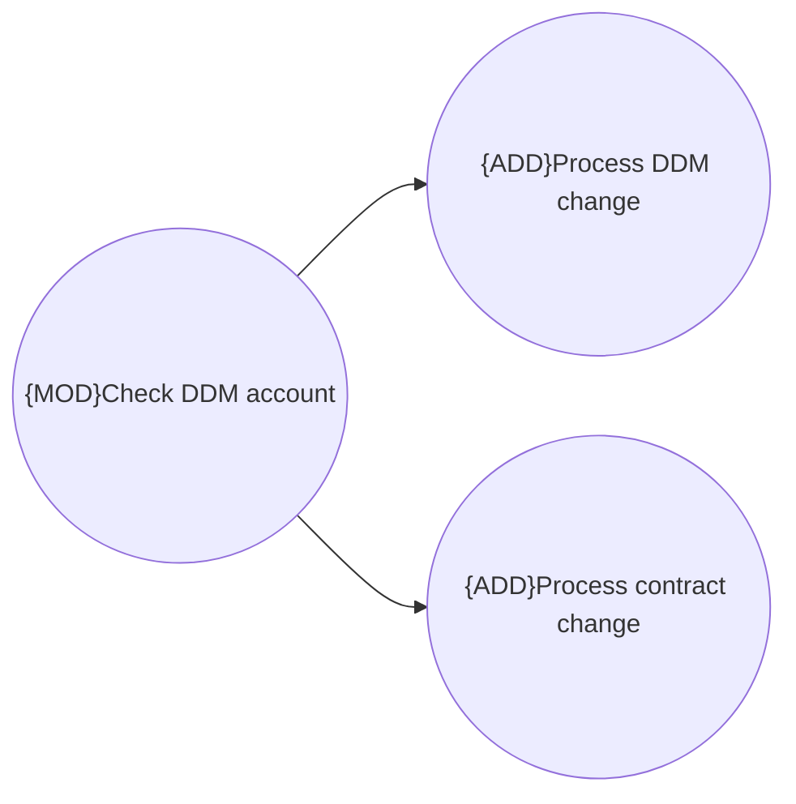

# Use cases

- **Diagram Type**: Use Case
- **Package**: HomerSelect/BSL/Modules/CEL Account (CELA)/Analytical model/DDM validation/Use cases
- **Diagram ID**: 156129
- **Elements**: 3
- **Connectors**: 2

