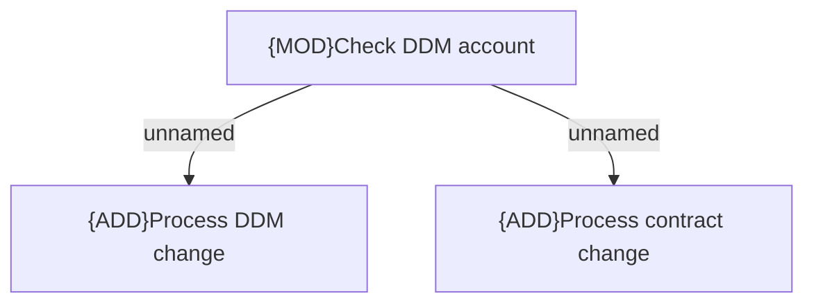

# Use cases

```mermaid
graph TD
    MOD_Check_DDM_account["{MOD}Check DDM account"]
    ADD_Process_contract_change["{ADD}Process contract change"]
    ADD_Process_DDM_change["{ADD}Process DDM change"]
    MOD_Check_DDM_account -->|unnamed| ADD_Process_DDM_change
    MOD_Check_DDM_account -->|unnamed| ADD_Process_contract_change
```
