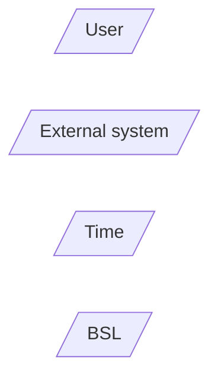

# Actors

- **Diagram Type**: Use Case
- **Package**: HomerSelect/BSL/Modules/Client center (CLC)/Actors
- **Diagram ID**: 164458
- **Elements**: 4
- **Connectors**: 0

```mermaid
graph LR
    User[/"User"/]
    External_system[/"External system"/]
    Time[/"Time"/]
    BSL[/"BSL"/]
```
