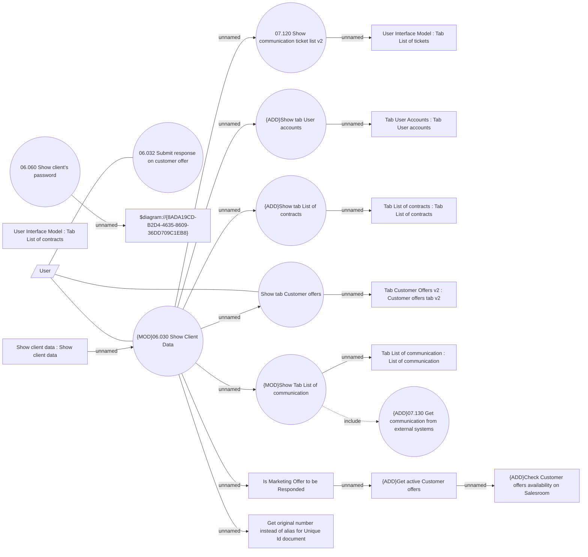

# Client Management

- **Diagram Type**: Use Case
- **Package**: HomerSelect/BSL/Modules/Client center (CLC)/Analytical Model/Client Detail/UseCase Model
- **Diagram ID**: 164421
- **Elements**: 22
- **Connectors**: 20

