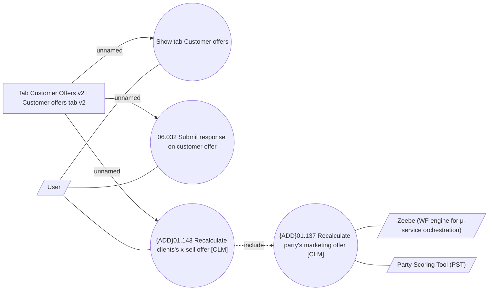

# Customer offers - UseCase Model

- **Diagram Type**: Use Case
- **Package**: HomerSelect/BSL/Modules/Client center (CLC)/Analytical Model/Client Detail/UseCase Model
- **Diagram ID**: 164422
- **Elements**: 8
- **Connectors**: 9

