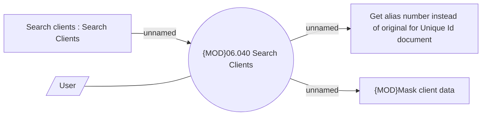

# Client Search

- **Diagram Type**: Use Case
- **Package**: HomerSelect/BSL/Modules/Client center (CLC)/Analytical Model/Client Search/UseCase Model
- **Diagram ID**: 160878
- **Elements**: 5
- **Connectors**: 4

