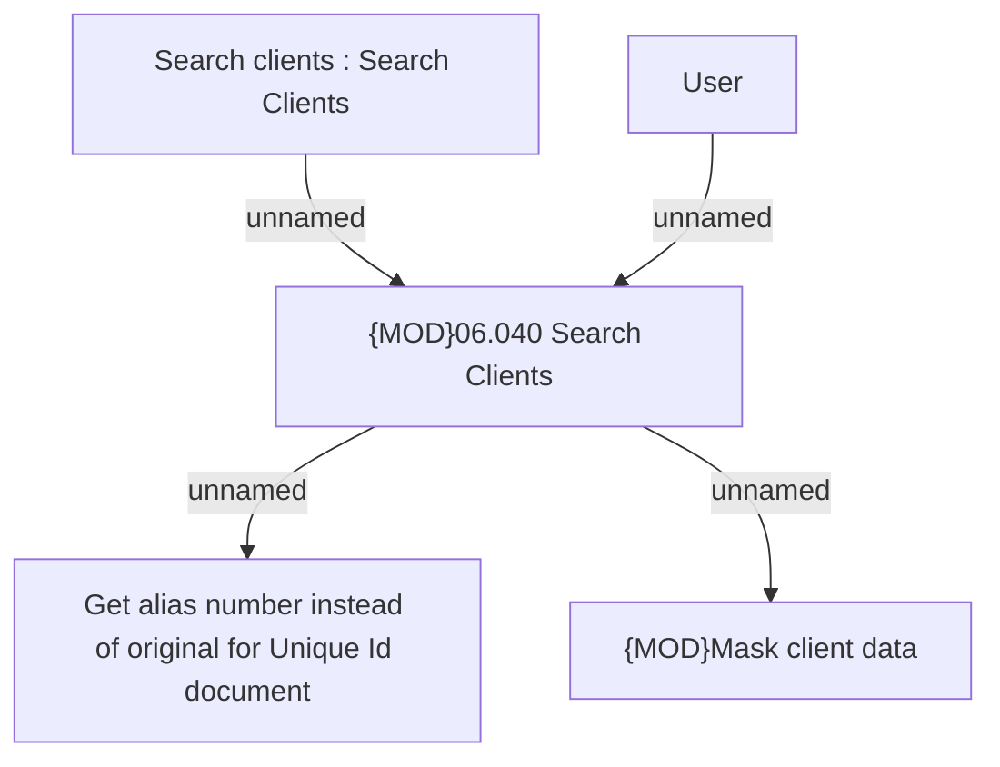

# Client Search

```mermaid
graph TD
    User["User"]
    MOD_Mask_client_data["{MOD}Mask client data"]
    Get_alias_number_instead_of_original_for_Unique_Id_document["Get alias number instead of original for Unique Id document"]
    Search_clients_Search_Clients["Search clients : Search Clients"]
    MOD_06_040_Search_Clients["{MOD}06.040 Search Clients"]
    Search_clients_Search_Clients -->|unnamed| MOD_06_040_Search_Clients
    MOD_06_040_Search_Clients -->|unnamed| Get_alias_number_instead_of_original_for_Unique_Id_document
    MOD_06_040_Search_Clients -->|unnamed| MOD_Mask_client_data
    User -->|unnamed| MOD_06_040_Search_Clients
```
