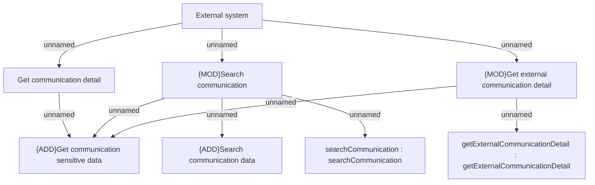

# Communication on external request

```mermaid
graph TD
    External_system["External system"]
    MOD_Get_external_communication_detail["{MOD}Get external communication detail"]
    getExternalCommunicationDetail_getExternalCommunicationDetai["getExternalCommunicationDetail : getExternalCommunicationDetail"]
    searchCommunication_searchCommunication["searchCommunication : searchCommunication"]
    ADD_Search_communication_data["{ADD}Search communication data"]
    ADD_Get_communication_sensitive_data["{ADD}Get communication sensitive data "]
    MOD_Search_communication["{MOD}Search communication"]
    Get_communication_detail["Get communication detail"]
    Get_communication_detail -->|unnamed| ADD_Get_communication_sensitive_data
    MOD_Search_communication -->|unnamed| ADD_Get_communication_sensitive_data
    MOD_Get_external_communication_detail -->|unnamed| ADD_Get_communication_sensitive_data
    MOD_Search_communication -->|unnamed| ADD_Search_communication_data
    MOD_Search_communication -->|unnamed| searchCommunication_searchCommunication
    MOD_Get_external_communication_detail -->|unnamed| getExternalCommunicationDetail_getExternalCommunicationDetai
    External_system -->|unnamed| MOD_Search_communication
    External_system -->|unnamed| MOD_Get_external_communication_detail
    External_system -->|unnamed| Get_communication_detail
```
