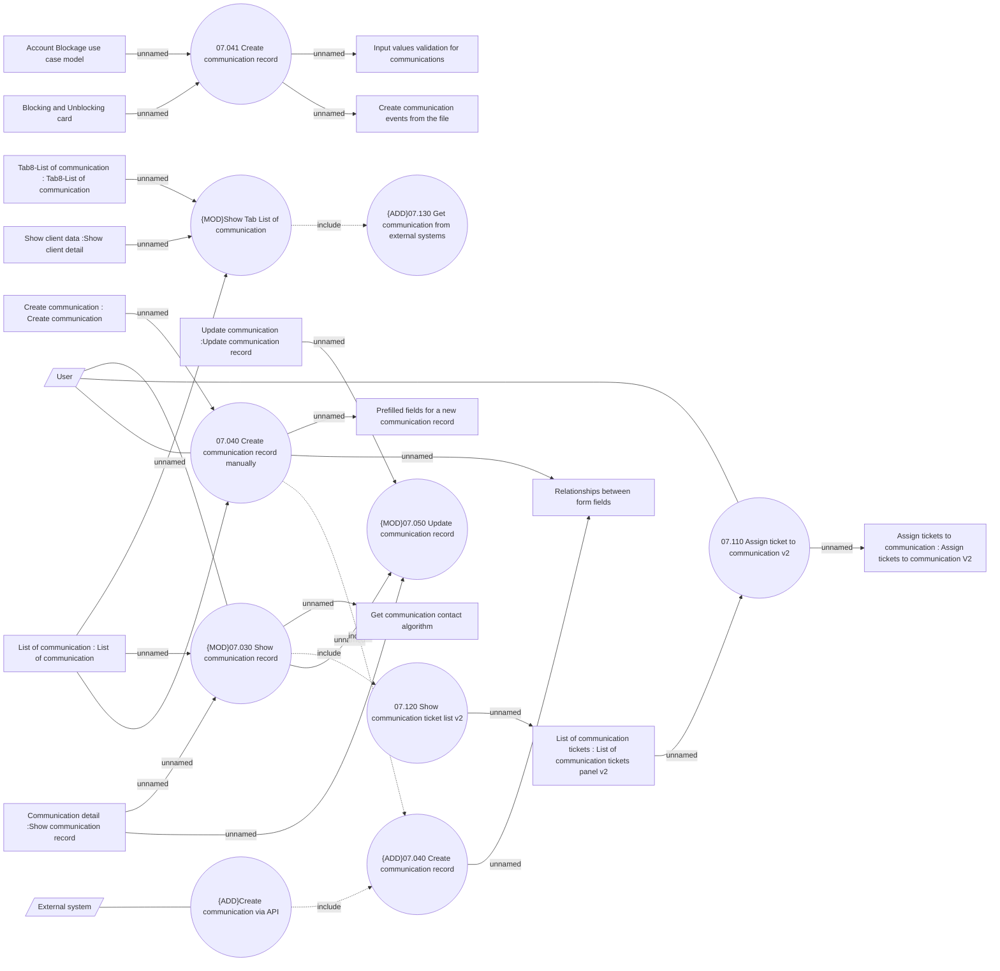

# Communication records

- **Diagram Type**: Use Case
- **Package**: HomerSelect/BSL/Modules/Client center (CLC)/Analytical Model/Communication/Manage communication/Use Case
- **Diagram ID**: 161770
- **Elements**: 27
- **Connectors**: 29

