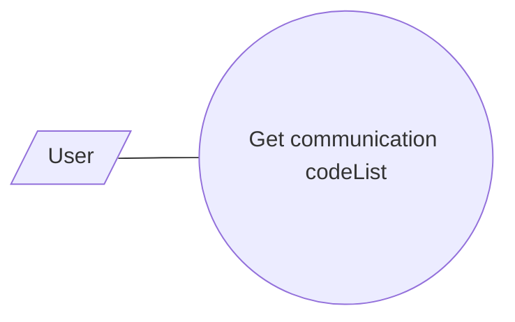

# codeList

- **Diagram Type**: Use Case
- **Package**: HomerSelect/BSL/Modules/Client center (CLC)/Interface Provided/REST API/v1/codeList/Use Case common
- **Diagram ID**: 163409
- **Elements**: 2
- **Connectors**: 1

