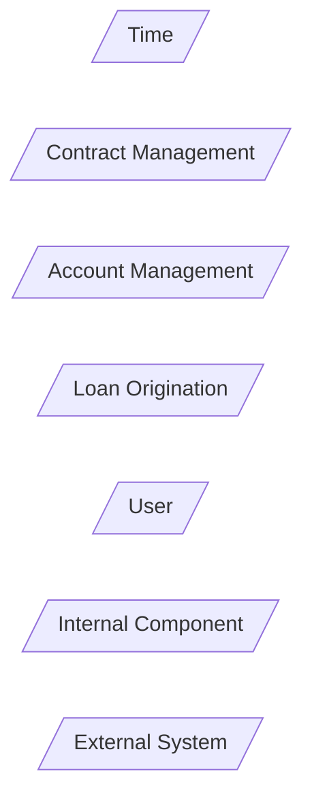

# Commodity - Actors

- **Diagram Type**: Use Case
- **Package**: HomerSelect/BSL/Modules/Commodity/Analytical Model/Actors
- **Diagram ID**: 161942
- **Elements**: 7
- **Connectors**: 0

```mermaid
graph LR
    Time[/"Time"/]
    Contract_Management[/"Contract Management"/]
    Account_Management[/"Account Management"/]
    Loan_Origination[/"Loan Origination"/]
    User[/"User"/]
    Internal_Component[/"Internal Component"/]
    External_System[/"External System"/]
```
