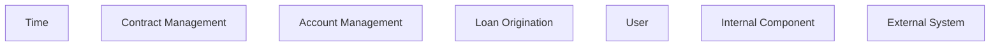

# Commodity - Actors

```mermaid
graph TD
    Time["Time"]
    Contract_Management["Contract Management"]
    Account_Management["Account Management"]
    Loan_Origination["Loan Origination"]
    User["User"]
    Internal_Component["Internal Component"]
    External_System["External System"]
```
