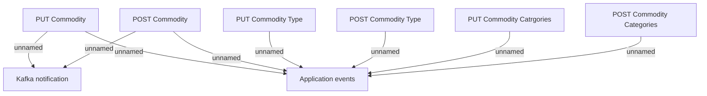

# Notification in Use Cases

```mermaid
graph TD
    POST_Commodity["POST Commodity"]
    Kafka_notification["Kafka notification"]
    PUT_Commodity_Type["PUT Commodity Type"]
    POST_Commodity_Type["POST Commodity Type"]
    PUT_Commodity_Catrgories["PUT Commodity Catrgories"]
    POST_Commodity_Categories["POST Commodity Categories"]
    PUT_Commodity["PUT Commodity"]
    Application_events["Application events"]
    POST_Commodity_Categories -->|unnamed| Application_events
    PUT_Commodity_Catrgories -->|unnamed| Application_events
    POST_Commodity_Type -->|unnamed| Application_events
    PUT_Commodity_Type -->|unnamed| Application_events
    POST_Commodity -->|unnamed| Kafka_notification
    POST_Commodity -->|unnamed| Application_events
    PUT_Commodity -->|unnamed| Kafka_notification
    PUT_Commodity -->|unnamed| Application_events
```
