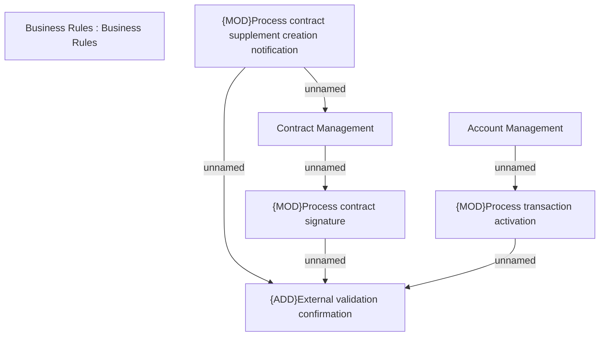

# Commodity activation

```mermaid
graph TD
    Business_Rules_Business_Rules["Business Rules : Business Rules"]
    ADD_External_validation_confirmation["{ADD}External validation confirmation"]
    MOD_Process_contract_supplement_creation_notification["{MOD}Process contract supplement creation notification"]
    Contract_Management["Contract Management"]
    Account_Management["Account Management"]
    MOD_Process_contract_signature["{MOD}Process contract signature"]
    MOD_Process_transaction_activation["{MOD}Process transaction activation"]
    MOD_Process_contract_supplement_creation_notification -->|unnamed| ADD_External_validation_confirmation
    MOD_Process_contract_signature -->|unnamed| ADD_External_validation_confirmation
    MOD_Process_transaction_activation -->|unnamed| ADD_External_validation_confirmation
    Account_Management -->|unnamed| MOD_Process_transaction_activation
    Contract_Management -->|unnamed| MOD_Process_contract_signature
    MOD_Process_contract_supplement_creation_notification -->|unnamed| Contract_Management
```
