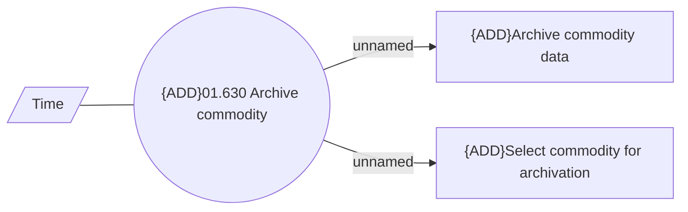

# Commodity archivation

- **Diagram Type**: Use Case
- **Package**: HomerSelect/BSL/Modules/Commodity/Analytical Model/Commodity Data/Use Case
- **Diagram ID**: 164433
- **Elements**: 4
- **Connectors**: 3

