# {DEL}Manage commodity data from external systems

- **Diagram Type**: Use Case
- **Package**: HomerSelect/BSL/Modules/Commodity/Analytical Model/Commodity Data/Use Case
- **Diagram ID**: 164430
- **Elements**: 27
- **Connectors**: 33

```mermaid
graph LR
    SearchCommodityData_SearchCommodityData["SearchCommodityData : SearchCommodityData"]
    DEL_GetCommodityValidationDataRequest_filter["{DEL}GetCommodityValidationDataRequest - filter"]
    DEL_GetCommodityValidationDataRequest_validation_rules["{DEL}GetCommodityValidationDataRequest - validation rules"]
    GetCommodityValidationData_DEL_GetCommodityValidationData["GetCommodityValidationData :{DEL}GetCommodityValidationData"]
    DEL_01_698_Provide_commodity_validation_data_for_external_sy(("{DEL}01.698 Provide commodity validation data for external systems"))
    ArchiveCommodityData_ArchiveCommodityData["ArchiveCommodityData : ArchiveCommodityData"]
    DEL_01_697_Archive_commodity_data_from_external_systems(("{DEL}01.697 Archive commodity data from external systems"))
    DEL_SearchCommodityDataRequest_validation_rules["{DEL}SearchCommodityDataRequest - validation rules"]
    DEL_SearchCommodityDataRequest_filter["{DEL}SearchCommodityDataRequest - filter"]
    DEL_01_696_Search_commodity_data_from_external_systems(("{DEL}01.696 Search commodity data from external systems"))
    UseCase_Model_Manage_contract_commodities["UseCase Model : Manage contract commodities"]
    MOD_Get_Commodity_Data_Enabled_For_Update["{MOD}Get Commodity Data Enabled For Update"]
    GetCommodityDataCodeLists_GetCommodityDataCodeLists["GetCommodityDataCodeLists : GetCommodityDataCodeLists"]
    DEL_01_695_Provide_commodity_data_code_lists_for_external_sy(("{DEL}01.695 Provide commodity data code lists for external systems"))
    Internal_Component[/"Internal Component"/]
    CreateCommodityData_CreateCommodityData["CreateCommodityData : CreateCommodityData"]
    DEL_01_694_Create_commodity_data_from_external_systems(("{DEL}01.694 Create commodity data from external systems"))
    Commodity_Validation_algorithm["Commodity Validation algorithm"]
    ValidateCommodityData_ValidateCommodityData["ValidateCommodityData : ValidateCommodityData"]
    DEL_01_693_Validate_commodity_data_from_external_systems(("{DEL}01.693 Validate commodity data from external systems"))
    UpdateCommodityData_UpdateCommodityData["UpdateCommodityData : UpdateCommodityData"]
    DEL_01_692_Update_commodity_data_from_external_systems(("{DEL}01.692 Update commodity data from external systems"))
    GetCommodityDataForUpdate_GetCommodityDataForUpdate["GetCommodityDataForUpdate :GetCommodityDataForUpdate"]
    GetCommodityData_GetCommodityData["GetCommodityData :GetCommodityData"]
    DEL_01_691_Provide_commodity_data_for_update_from_external_s(("{DEL}01.691 Provide commodity data for update from external systems"))
    DEL_CommodityDataRequest_validation_rules["{DEL}CommodityDataRequest - validation rules"]
    DEL_01_690_Provide_commodity_data_for_external_systems(("{DEL}01.690 Provide commodity data for external systems"))
    DEL_01_696_Search_commodity_data_from_external_systems -->|unnamed| DEL_SearchCommodityDataRequest_filter
    Internal_Component --- DEL_01_694_Create_commodity_data_from_external_systems
    GetCommodityDataCodeLists_GetCommodityDataCodeLists -->|unnamed| DEL_01_695_Provide_commodity_data_code_lists_for_external_sy
    Internal_Component --- DEL_01_695_Provide_commodity_data_code_lists_for_external_sy
    DEL_CommodityDataRequest_validation_rules -->|unnamed| MOD_Get_Commodity_Data_Enabled_For_Update
    DEL_01_691_Provide_commodity_data_for_update_from_external_s -->|unnamed| MOD_Get_Commodity_Data_Enabled_For_Update
    DEL_01_698_Provide_commodity_validation_data_for_external_sy -->|unnamed| DEL_GetCommodityValidationDataRequest_filter
    Internal_Component --- DEL_01_696_Search_commodity_data_from_external_systems
    DEL_CommodityDataRequest_validation_rules -->|unnamed| Commodity_Validation_algorithm
    DEL_01_696_Search_commodity_data_from_external_systems -->|unnamed| DEL_SearchCommodityDataRequest_validation_rules
    ArchiveCommodityData_ArchiveCommodityData -->|unnamed| DEL_01_697_Archive_commodity_data_from_external_systems
    Internal_Component --- DEL_01_697_Archive_commodity_data_from_external_systems
    Internal_Component --- DEL_01_698_Provide_commodity_validation_data_for_external_sy
    GetCommodityValidationData_DEL_GetCommodityValidationData -->|unnamed| DEL_01_698_Provide_commodity_validation_data_for_external_sy
    DEL_01_698_Provide_commodity_validation_data_for_external_sy -->|unnamed| DEL_GetCommodityValidationDataRequest_validation_rules
    SearchCommodityData_SearchCommodityData -->|unnamed| DEL_01_696_Search_commodity_data_from_external_systems
    DEL_01_691_Provide_commodity_data_for_update_from_external_s -->|unnamed| GetCommodityDataForUpdate_GetCommodityDataForUpdate
    DEL_01_693_Validate_commodity_data_from_external_systems -->|unnamed| DEL_CommodityDataRequest_validation_rules
    DEL_01_694_Create_commodity_data_from_external_systems -->|unnamed| DEL_CommodityDataRequest_validation_rules
    DEL_01_697_Archive_commodity_data_from_external_systems -->|unnamed| DEL_CommodityDataRequest_validation_rules
    DEL_01_691_Provide_commodity_data_for_update_from_external_s -->|unnamed| DEL_CommodityDataRequest_validation_rules
    DEL_01_690_Provide_commodity_data_for_external_systems -->|unnamed| DEL_CommodityDataRequest_validation_rules
    DEL_01_692_Update_commodity_data_from_external_systems -->|unnamed| DEL_CommodityDataRequest_validation_rules
    CreateCommodityData_CreateCommodityData -->|unnamed| DEL_01_694_Create_commodity_data_from_external_systems
    DEL_01_690_Provide_commodity_data_for_external_systems -->|unnamed| GetCommodityData_GetCommodityData
    DEL_01_693_Validate_commodity_data_from_external_systems -->|unnamed| Commodity_Validation_algorithm
    UpdateCommodityData_UpdateCommodityData -->|unnamed| DEL_01_692_Update_commodity_data_from_external_systems
    Internal_Component --- DEL_01_692_Update_commodity_data_from_external_systems
    Internal_Component --- DEL_01_693_Validate_commodity_data_from_external_systems
    ValidateCommodityData_ValidateCommodityData -->|unnamed| DEL_01_693_Validate_commodity_data_from_external_systems
    DEL_01_692_Update_commodity_data_from_external_systems -->|unnamed| Commodity_Validation_algorithm
    Internal_Component --- DEL_01_690_Provide_commodity_data_for_external_systems
    Internal_Component --- DEL_01_691_Provide_commodity_data_for_update_from_external_s
```

