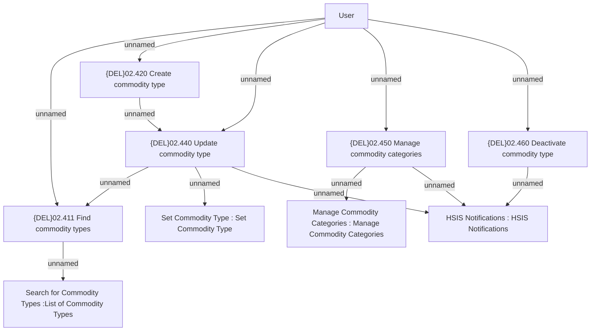

# Manage Commodity Types and Categories by GUI

```mermaid
graph TD
    User["User"]
    HSIS_Notifications_HSIS_Notifications["HSIS Notifications : HSIS Notifications"]
    DEL_02_460_Deactivate_commodity_type["{DEL}02.460 Deactivate commodity type"]
    Manage_Commodity_Categories_Manage_Commodity_Categories["Manage Commodity Categories : Manage Commodity Categories"]
    Set_Commodity_Type_Set_Commodity_Type["Set Commodity Type : Set Commodity Type"]
    Search_for_Commodity_Types_List_of_Commodity_Types["Search for Commodity Types :List of Commodity Types"]
    DEL_02_450_Manage_commodity_categories["{DEL}02.450 Manage commodity categories"]
    DEL_02_440_Update_commodity_type["{DEL}02.440 Update commodity type"]
    DEL_02_420_Create_commodity_type["{DEL}02.420 Create commodity type"]
    DEL_02_411_Find_commodity_types["{DEL}02.411 Find commodity types"]
    DEL_02_440_Update_commodity_type -->|unnamed| DEL_02_411_Find_commodity_types
    User -->|unnamed| DEL_02_411_Find_commodity_types
    User -->|unnamed| DEL_02_420_Create_commodity_type
    DEL_02_420_Create_commodity_type -->|unnamed| DEL_02_440_Update_commodity_type
    User -->|unnamed| DEL_02_440_Update_commodity_type
    User -->|unnamed| DEL_02_450_Manage_commodity_categories
    DEL_02_411_Find_commodity_types -->|unnamed| Search_for_Commodity_Types_List_of_Commodity_Types
    DEL_02_440_Update_commodity_type -->|unnamed| Set_Commodity_Type_Set_Commodity_Type
    DEL_02_450_Manage_commodity_categories -->|unnamed| Manage_Commodity_Categories_Manage_Commodity_Categories
    User -->|unnamed| DEL_02_460_Deactivate_commodity_type
    DEL_02_440_Update_commodity_type -->|unnamed| HSIS_Notifications_HSIS_Notifications
    DEL_02_450_Manage_commodity_categories -->|unnamed| HSIS_Notifications_HSIS_Notifications
    DEL_02_460_Deactivate_commodity_type -->|unnamed| HSIS_Notifications_HSIS_Notifications
```
