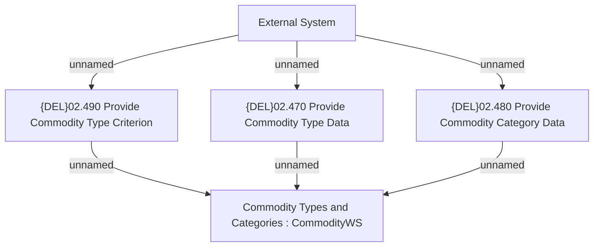

# {DEL}Manage Commodity Types and Categories from external system

```mermaid
graph TD
    DEL_02_490_Provide_Commodity_Type_Criterion["{DEL}02.490 Provide Commodity Type Criterion"]
    External_System["External System"]
    Commodity_Types_and_Categories_CommodityWS["Commodity Types and Categories : CommodityWS"]
    DEL_02_480_Provide_Commodity_Category_Data["{DEL}02.480 Provide Commodity Category Data"]
    DEL_02_470_Provide_Commodity_Type_Data["{DEL}02.470 Provide Commodity Type Data"]
    External_System -->|unnamed| DEL_02_470_Provide_Commodity_Type_Data
    External_System -->|unnamed| DEL_02_480_Provide_Commodity_Category_Data
    DEL_02_490_Provide_Commodity_Type_Criterion -->|unnamed| Commodity_Types_and_Categories_CommodityWS
    DEL_02_470_Provide_Commodity_Type_Data -->|unnamed| Commodity_Types_and_Categories_CommodityWS
    DEL_02_480_Provide_Commodity_Category_Data -->|unnamed| Commodity_Types_and_Categories_CommodityWS
    External_System -->|unnamed| DEL_02_490_Provide_Commodity_Type_Criterion
```
