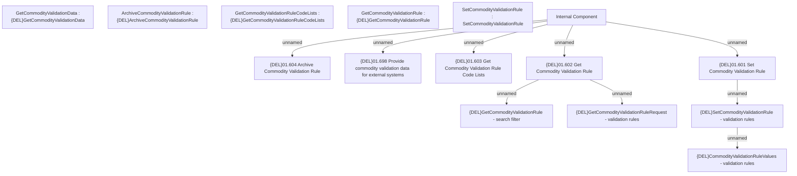

# Commodity Validation Setting UC

```mermaid
graph TD
    GetCommodityValidationData_DEL_GetCommodityValidationData["GetCommodityValidationData :{DEL}GetCommodityValidationData"]
    ArchiveCommodityValidationRule_DEL_ArchiveCommodityValidatio["ArchiveCommodityValidationRule :{DEL}ArchiveCommodityValidationRule"]
    GetCommodityValidationRuleCodeLists_DEL_GetCommodityValidati["GetCommodityValidationRuleCodeLists :{DEL}GetCommodityValidationRuleCodeLists"]
    GetCommodityValidationRule_DEL_GetCommodityValidationRule["GetCommodityValidationRule :{DEL}GetCommodityValidationRule"]
    SetCommodityValidationRule_SetCommodityValidationRule["SetCommodityValidationRule : SetCommodityValidationRule"]
    DEL_01_604_Archive_Commodity_Validation_Rule["{DEL}01.604 Archive Commodity Validation Rule"]
    DEL_01_698_Provide_commodity_validation_data_for_external_sy["{DEL}01.698 Provide commodity validation data for external systems"]
    Internal_Component["Internal Component"]
    DEL_GetCommodityValidationRule_search_filter["{DEL}GetCommodityValidationRule - search filter"]
    DEL_GetCommodityValidationRuleRequest_validation_rules["{DEL}GetCommodityValidationRuleRequest - validation rules"]
    DEL_CommodityValidationRuleValues_validation_rules["{DEL}CommodityValidationRuleValues - validation rules"]
    DEL_01_603_Get_Commodity_Validation_Rule_Code_Lists["{DEL}01.603 Get Commodity Validation Rule Code Lists"]
    DEL_01_602_Get_Commodity_Validation_Rule["{DEL}01.602 Get Commodity Validation Rule"]
    DEL_01_601_Set_Commodity_Validation_Rule["{DEL}01.601 Set Commodity Validation Rule"]
    DEL_SetCommodityValidationRule_validation_rules["{DEL}SetCommodityValidationRule - validation rules"]
    DEL_01_601_Set_Commodity_Validation_Rule -->|unnamed| DEL_SetCommodityValidationRule_validation_rules
    Internal_Component -->|unnamed| DEL_01_601_Set_Commodity_Validation_Rule
    Internal_Component -->|unnamed| DEL_01_602_Get_Commodity_Validation_Rule
    Internal_Component -->|unnamed| DEL_01_603_Get_Commodity_Validation_Rule_Code_Lists
    DEL_SetCommodityValidationRule_validation_rules -->|unnamed| DEL_CommodityValidationRuleValues_validation_rules
    DEL_01_602_Get_Commodity_Validation_Rule -->|unnamed| DEL_GetCommodityValidationRuleRequest_validation_rules
    DEL_01_602_Get_Commodity_Validation_Rule -->|unnamed| DEL_GetCommodityValidationRule_search_filter
    Internal_Component -->|unnamed| DEL_01_698_Provide_commodity_validation_data_for_external_sy
    Internal_Component -->|unnamed| DEL_01_604_Archive_Commodity_Validation_Rule
```
