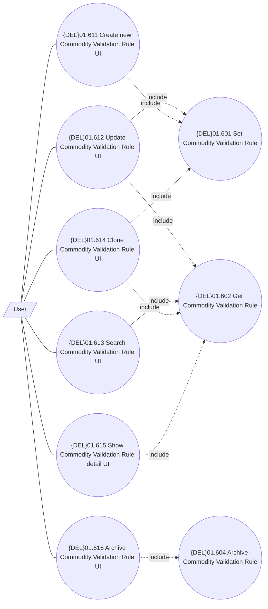

# UI for management of Commodity Validation Setting

- **Diagram Type**: Use Case
- **Package**: HomerSelect/BSL/Modules/Commodity/Analytical Model/Commodity Validation Setting/UI for Commodity Validation Setting/Use Case
- **Diagram ID**: 162290
- **Elements**: 10
- **Connectors**: 14

