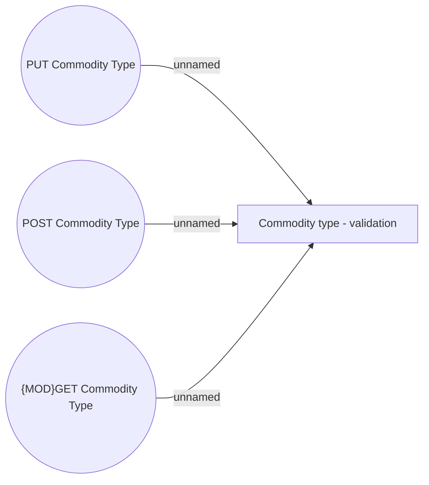

# Use Case

- **Diagram Type**: Use Case
- **Package**: HomerSelect/BSL/Modules/Commodity/Interface Provided/Commodity API/Commodity Type/Use Case
- **Diagram ID**: 135952
- **Elements**: 4
- **Connectors**: 3

