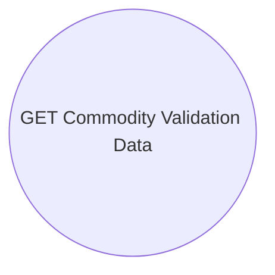

# Use Case

- **Diagram Type**: Use Case
- **Package**: HomerSelect/BSL/Modules/Commodity/Interface Provided/Commodity API/Commodity Validation Data/Use Case
- **Diagram ID**: 130275
- **Elements**: 1
- **Connectors**: 0

