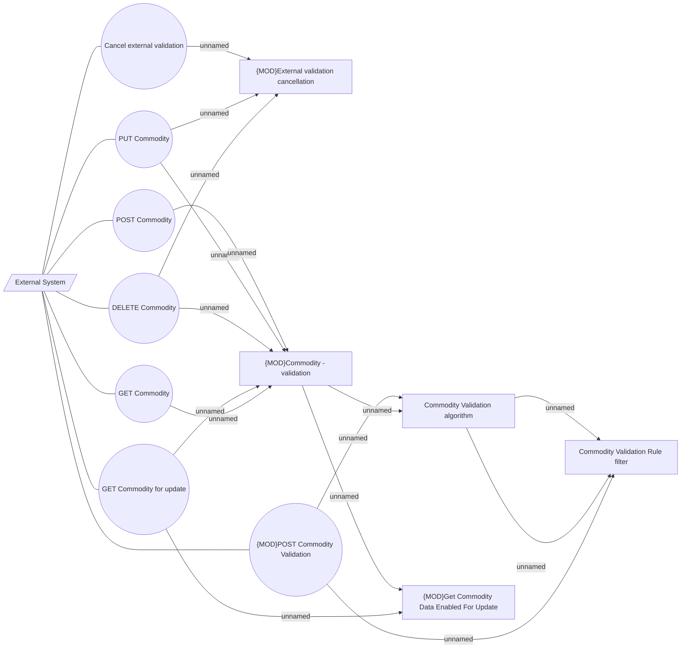

# Use Case

- **Diagram Type**: Use Case
- **Package**: HomerSelect/BSL/Modules/Commodity/Interface Provided/Commodity API/Commodity/Use Case
- **Diagram ID**: 164403
- **Elements**: 13
- **Connectors**: 22

