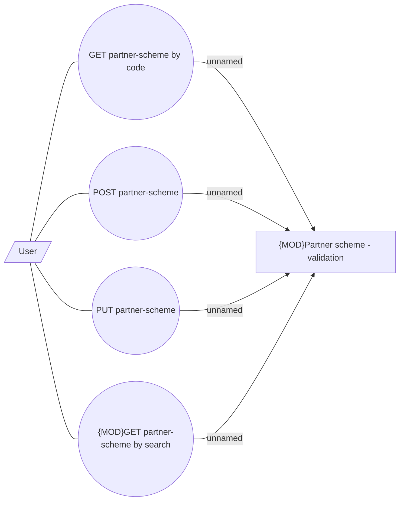

# Use Case

- **Diagram Type**: Use Case
- **Package**: HomerSelect/BSL/Modules/Commodity/Interface Provided/Commodity API/Partner Scheme/Use Case
- **Diagram ID**: 158947
- **Elements**: 6
- **Connectors**: 8

