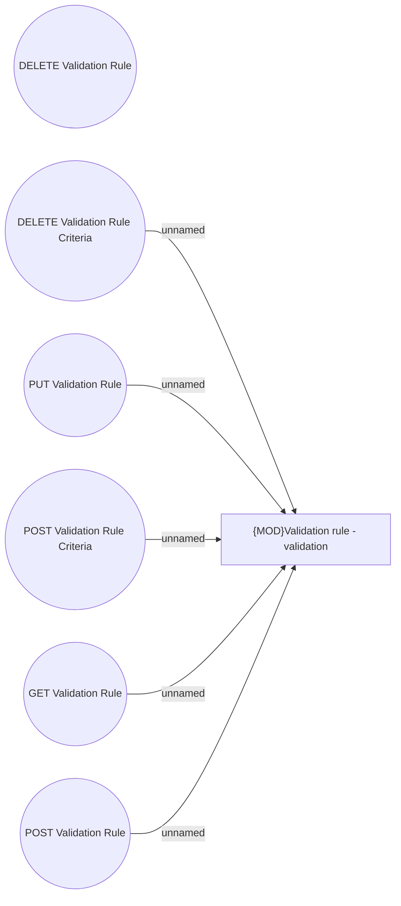

# Use Case

- **Diagram Type**: Use Case
- **Package**: HomerSelect/BSL/Modules/Commodity/Interface Provided/Commodity API/Validation Rule/Use Case
- **Diagram ID**: 130272
- **Elements**: 7
- **Connectors**: 5

