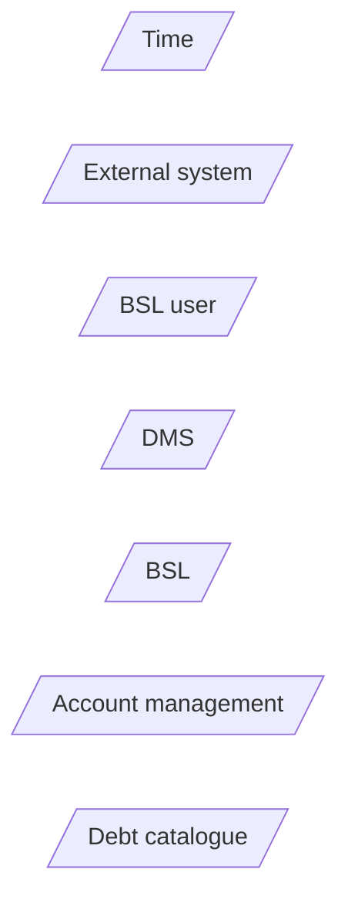

# Actors

- **Diagram Type**: Use Case
- **Package**: HomerSelect/BSL/Modules/Contract Management (COMA)/Actors
- **Diagram ID**: 162030
- **Elements**: 7
- **Connectors**: 0

```mermaid
graph LR
    Time[/"Time"/]
    External_system[/"External system"/]
    BSL_user[/"BSL user"/]
    DMS[/"DMS"/]
    BSL[/"BSL"/]
    Account_management[/"Account management"/]
    Debt_catalogue[/"Debt catalogue"/]
```
