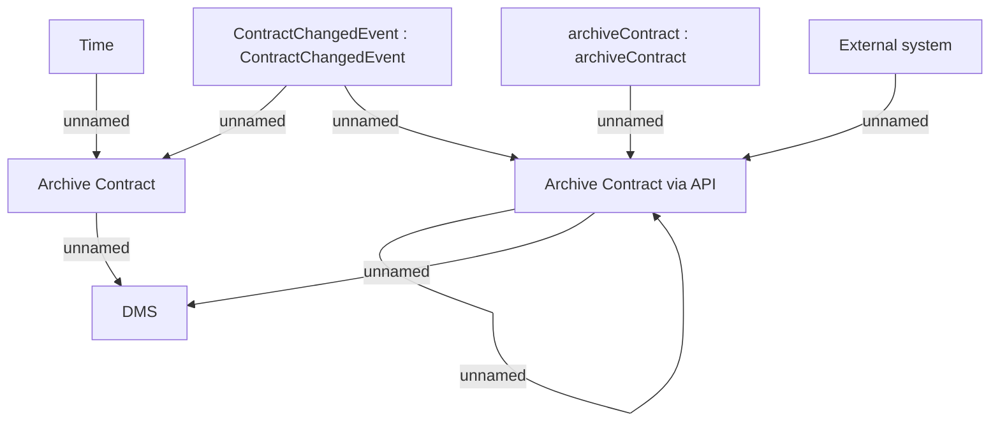

# Contract Archivation

```mermaid
graph TD
    archiveContract_archiveContract["archiveContract : archiveContract"]
    External_system["External system"]
    Time["Time"]
    Archive_Contract_via_API["Archive Contract via API"]
    DMS["DMS"]
    ContractChangedEvent_ContractChangedEvent["ContractChangedEvent : ContractChangedEvent"]
    Archive_Contract_via_API["Archive Contract via API"]
    Archive_Contract["Archive Contract"]
    archiveContract_archiveContract -->|unnamed| Archive_Contract_via_API
    Archive_Contract -->|unnamed| DMS
    ContractChangedEvent_ContractChangedEvent -->|unnamed| Archive_Contract
    ContractChangedEvent_ContractChangedEvent -->|unnamed| Archive_Contract_via_API
    Archive_Contract_via_API -->|unnamed| Archive_Contract_via_API
    Archive_Contract_via_API -->|unnamed| DMS
    Time -->|unnamed| Archive_Contract
    External_system -->|unnamed| Archive_Contract_via_API
```
