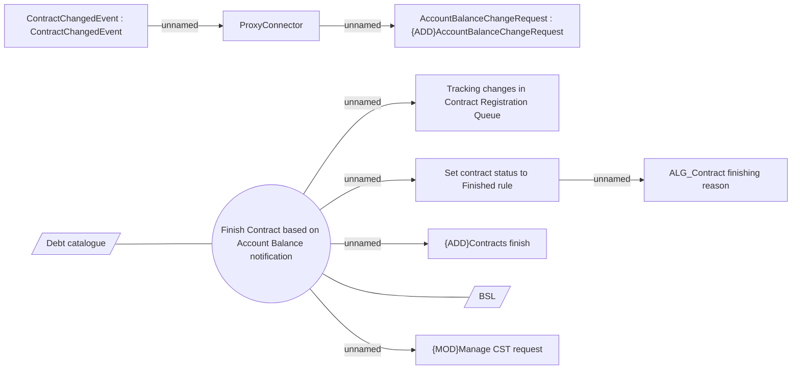

# Contracts finishing

- **Diagram Type**: Use Case
- **Package**: HomerSelect/BSL/Modules/Contract Management (COMA)/Analytical Model/Contract Operations/Contract Finishing/Use Case Model
- **Diagram ID**: 163119
- **Elements**: 12
- **Connectors**: 9

