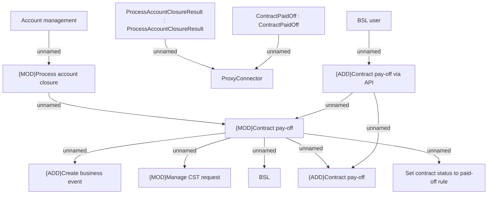

# Contract pay-off

```mermaid
graph TD
    BSL_user["BSL user"]
    ADD_Contract_pay_off_via_API["{ADD}Contract pay-off via API"]
    ProxyConnector["ProxyConnector"]
    ProxyConnector["ProxyConnector"]
    MOD_Process_account_closure["{MOD}Process account closure"]
    Set_contract_status_to_paid_off_rule["Set contract status to paid-off rule"]
    ProcessAccountClosureResult_ProcessAccountClosureResult["ProcessAccountClosureResult : ProcessAccountClosureResult"]
    ContractPaidOff_ContractPaidOff["ContractPaidOff : ContractPaidOff"]
    ADD_Contract_pay_off["{ADD}Contract pay-off"]
    MOD_Contract_pay_off["{MOD}Contract pay-off"]
    BSL["BSL"]
    MOD_Manage_CST_request["{MOD}Manage CST request"]
    ADD_Create_business_event["{ADD}Create business event"]
    Account_management["Account management"]
    MOD_Contract_pay_off -->|unnamed| ADD_Create_business_event
    MOD_Contract_pay_off -->|unnamed| MOD_Manage_CST_request
    MOD_Contract_pay_off -->|unnamed| BSL
    MOD_Process_account_closure -->|unnamed| MOD_Contract_pay_off
    ADD_Contract_pay_off_via_API -->|unnamed| MOD_Contract_pay_off
    MOD_Contract_pay_off -->|unnamed| ADD_Contract_pay_off
    ADD_Contract_pay_off_via_API -->|unnamed| ADD_Contract_pay_off
    MOD_Contract_pay_off -->|unnamed| Set_contract_status_to_paid_off_rule
    ProcessAccountClosureResult_ProcessAccountClosureResult -->|unnamed| ProxyConnector
    ContractPaidOff_ContractPaidOff -->|unnamed| ProxyConnector
    Account_management -->|unnamed| MOD_Process_account_closure
    BSL_user -->|unnamed| ADD_Contract_pay_off_via_API
```
