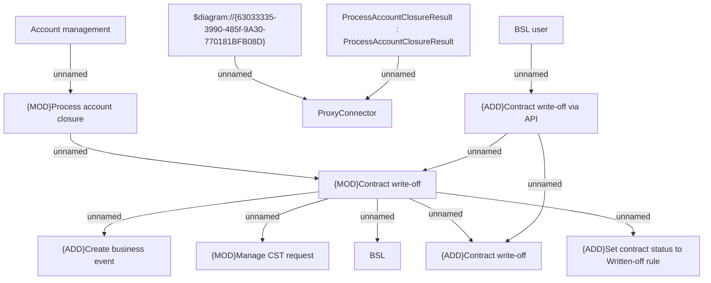

# Contract write-off

```mermaid
graph TD
    BSL_user["BSL user"]
    ADD_Contract_write_off_via_API["{ADD}Contract write-off via API"]
    ProxyConnector["ProxyConnector"]
    ProxyConnector["ProxyConnector"]
    MOD_Process_account_closure["{MOD}Process account closure"]
    ADD_Set_contract_status_to_Written_off_rule["{ADD}Set contract status to Written-off rule"]
    diagram_63033335_3990_485f_9A30_770181BFB08D["$diagram://{63033335-3990-485f-9A30-770181BFB08D}"]
    BSL["BSL"]
    ProcessAccountClosureResult_ProcessAccountClosureResult["ProcessAccountClosureResult : ProcessAccountClosureResult"]
    ADD_Contract_write_off["{ADD}Contract write-off"]
    MOD_Manage_CST_request["{MOD}Manage CST request"]
    ADD_Create_business_event["{ADD}Create business event"]
    Account_management["Account management"]
    MOD_Contract_write_off["{MOD}Contract write-off"]
    ADD_Contract_write_off_via_API -->|unnamed| MOD_Contract_write_off
    MOD_Process_account_closure -->|unnamed| MOD_Contract_write_off
    MOD_Contract_write_off -->|unnamed| ADD_Create_business_event
    MOD_Contract_write_off -->|unnamed| MOD_Manage_CST_request
    ADD_Contract_write_off_via_API -->|unnamed| ADD_Contract_write_off
    MOD_Contract_write_off -->|unnamed| ADD_Contract_write_off
    MOD_Contract_write_off -->|unnamed| BSL
    MOD_Contract_write_off -->|unnamed| ADD_Set_contract_status_to_Written_off_rule
    ProcessAccountClosureResult_ProcessAccountClosureResult -->|unnamed| ProxyConnector
    diagram_63033335_3990_485f_9A30_770181BFB08D -->|unnamed| ProxyConnector
    Account_management -->|unnamed| MOD_Process_account_closure
    BSL_user -->|unnamed| ADD_Contract_write_off_via_API
```
