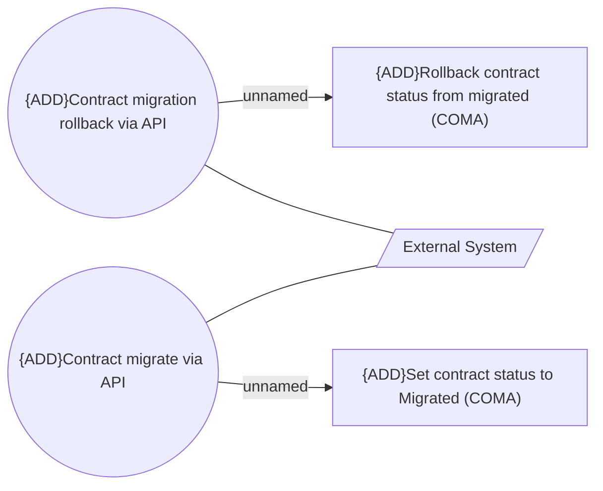

# Use Case Model

- **Diagram Type**: Use Case
- **Package**: HomerSelect/BSL/Modules/Contract Management (COMA)/Analytical Model/Contract Operations/Contract migration/Use Case Model
- **Diagram ID**: 164704
- **Elements**: 5
- **Connectors**: 4

