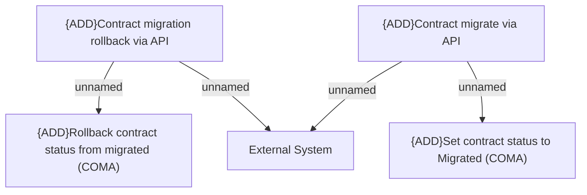

# Use Case Model

```mermaid
graph TD
    ADD_Rollback_contract_status_from_migrated_COMA["{ADD}Rollback contract status from migrated (COMA)"]
    ADD_Contract_migration_rollback_via_API["{ADD}Contract migration rollback via API"]
    External_System["External System"]
    ADD_Set_contract_status_to_Migrated_COMA["{ADD}Set contract status to Migrated (COMA)"]
    ADD_Contract_migrate_via_API["{ADD}Contract migrate via API"]
    ADD_Contract_migration_rollback_via_API -->|unnamed| ADD_Rollback_contract_status_from_migrated_COMA
    ADD_Contract_migrate_via_API -->|unnamed| External_System
    ADD_Contract_migration_rollback_via_API -->|unnamed| External_System
    ADD_Contract_migrate_via_API -->|unnamed| ADD_Set_contract_status_to_Migrated_COMA
```
