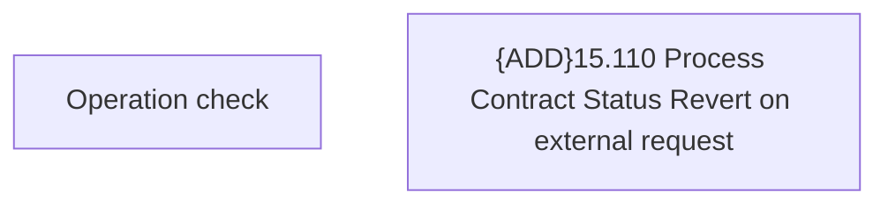

# Contract Status Revert on external request

```mermaid
graph TD
    Operation_check["Operation check"]
    ADD_15_110_Process_Contract_Status_Revert_on_external_reques["{ADD}15.110 Process Contract Status Revert on external request"]
```
