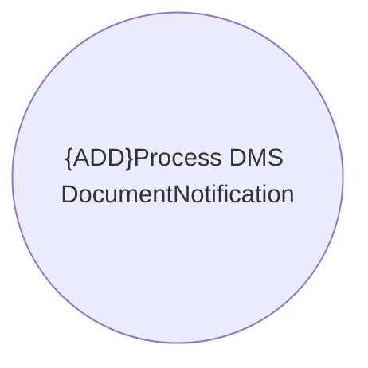

# Use Cases

- **Diagram Type**: Use Case
- **Package**: HomerSelect/BSL/Modules/Contract Management (COMA)/Interface Consumed/Kafka/Use Cases
- **Diagram ID**: 164644
- **Elements**: 1
- **Connectors**: 0

