# Use Cases

- **Diagram Type**: Use Case
- **Package**: HomerSelect/BSL/Modules/Contract Management (COMA)/Interface Provided/REST/Use Cases
- **Diagram ID**: 163937
- **Elements**: 20
- **Connectors**: 2

```mermaid
graph LR
    Get_Contract_Party_Role(("Get Contract Party Role"))
    External_system[/"External system"/]
    Create_Contract_Party_Role(("Create Contract Party Role"))
    Get_contract_applicant(("Get contract applicant"))
    Update_contract_extended_property(("Update contract extended property"))
    Delete_contract_extended_property(("Delete contract extended property"))
    Create_contract_extended_property(("Create contract extended property"))
    ADD_Contracts_validation_v2(("{ADD}Contracts validation v2"))
    Get_contract_status_transitions(("Get contract status transitions"))
    ADD_Get_refinanced_contracts(("{ADD}Get refinanced contracts"))
    Get_contract_extended_properties(("Get contract extended properties"))
    Create_contract_business_event(("Create contract business event"))
    Get_contract_business_events(("Get contract business events"))
    MOD_Get_contract_account(("{MOD}Get contract account"))
    MOD_Get_contract_customer(("{MOD}Get contract customer"))
    MOD_Contracts_search(("{MOD}Contracts search"))
    Get_contract(("Get contract"))
    MOD_Contracts_validation(("{MOD}Contracts validation"))
    MOD_15_109_Contract_Status_Revert_on_external_request(("{MOD}15.109 Contract Status Revert on external request"))
    Humans_on_entities["Humans on entities"]
    External_system --- Create_Contract_Party_Role
    External_system --- Get_Contract_Party_Role
```

