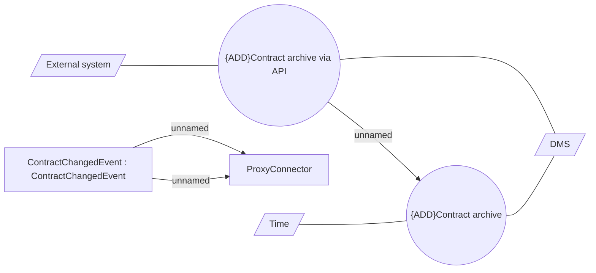

# Contract Archivation

- **Diagram Type**: Use Case
- **Package**: HomerSelect/BSL/Modules/Contract Management (COMA_NG)/Analytical Model/Contract Operations/Archive Contract/Use Case Model
- **Diagram ID**: 163450
- **Elements**: 9
- **Connectors**: 7

